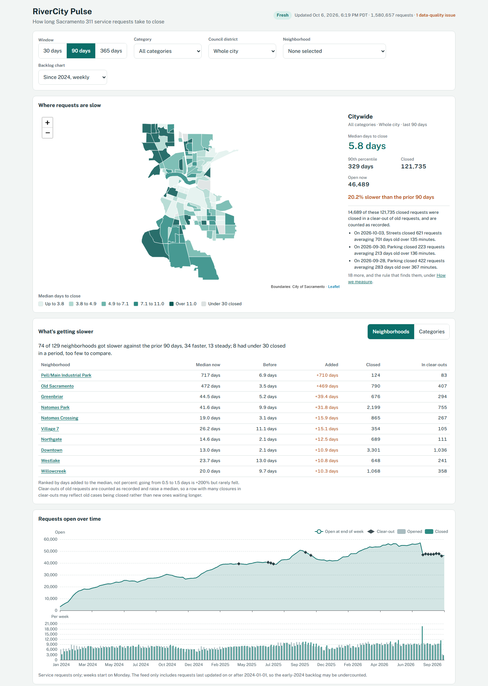
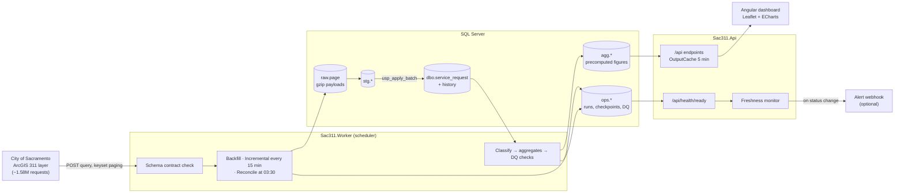
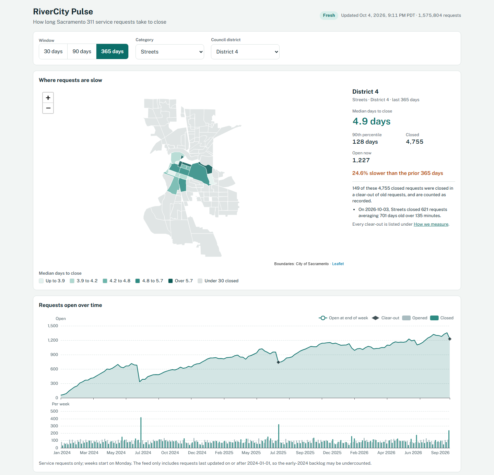

# RiverCity Pulse

[](https://github.com/eduong8366/RiverCity-Pulse/actions/workflows/ci.yml)

A data pipeline and dashboard for the City of Sacramento's public 311 service requests. A .NET worker ingests the city's ArcGIS feed into SQL Server (raw, staging, cleaned and history layers), an ASP.NET Core API serves aggregates, and an Angular dashboard shows how long requests take to close by neighborhood and category.



What it is built to show:

- **Idempotent, resumable ingestion.** Keyset paging, one transaction per page with its checkpoint, row hashes, and a watermark that moves only on success. Rerunning changes nothing, and a killed backfill resumes from its last page.
- **Figures you can check.** Every figure is defined in [`docs/metrics.md`](docs/metrics.md) with SQL that reproduces it, and everything the figures leave out is published with its count, on the page and at `/api/meta/exclusions`.
- **Tests against real SQL Server.** The integration suite runs the real jobs against a throwaway database and a WireMock.Net fake of the ArcGIS layer, locally and in CI.
- **Operations.** Data-quality checks after every run, a daily reconcile, health checks, alerts on readiness changes, and a [schema drift drill](docs/incidents/2026-10-04-schema-drift-drill.md) with its runbook.

## How it works



Each page from the source is stored raw, cleaned in C# (pure functions in `Sac311.Domain`), bulk-copied into staging and applied by `usp_apply_batch` in one transaction with the checkpoint. Changed rows get a history row; rows that leave the source are marked, never deleted. After a run that changed anything, the worker reclassifies requests for the metrics and rebuilds the `agg` tables in about 20 seconds, so every API call is a point lookup.

## Repository layout

| Path | Contents |
|---|---|
| `src/` | `Sac311.Domain`, `Sac311.Data`, `Sac311.Ingestion`, `Sac311.Worker`, `Sac311.Api` |
| `tests/` | Domain, integration, API and end-to-end test projects. Integration tests run the real jobs against a throwaway SQL Server database and a WireMock.Net fake of the ArcGIS layer; API tests run the API (`WebApplicationFactory`) on a seeded throwaway database. `Sac311.Testing` holds the shared database fixture (`SAC311_TEST_SQL` picks the server; the default is the local SQL Express). End-to-end tests (`Sac311.E2E.Tests`) drive the dashboard in headless Chromium (Playwright for .NET) over the real API and the API tests' seeded database |
| `tools/FakeArcGis/` | The incident-drill proxy: the live layer with one field renamed on demand, plus an alert webhook sink (see [Operations](#operations)) |
| `db/` | SQL run by `worker migrate`: `migrations/` (one-time, journaled), `programmable/` (procs, always run), `seed/` (reference data, idempotent) |
| `docs/` | [`metrics.md`](docs/metrics.md): what every figure means, what it leaves out and why, with SQL to check it. [`tradeoffs.md`](docs/tradeoffs.md): design choices and their alternatives. [`source-profile.md`](docs/source-profile.md): measured facts about the source data and its terms of use. [`incidents/`](docs/incidents/): drill and incident write-ups. [`design/decision.md`](docs/design/decision.md): the dashboard layout decision |
| `web/` | The Angular dashboard (`rivercity-pulse`): Leaflet map, neighborhood drawer, "What's getting slower" panel, ECharts backlog chart, categories table, "How we measure" panel |
| `data/geo/` | Sacramento neighborhood boundaries (GeoJSON, WGS84), served to the map by `/api/geo/neighborhoods` |

## Run it locally

Prerequisites:

- .NET SDK 10.0.401 (pinned in `global.json`)
- Node 24 with npm, for the dashboard only (`npm ci` in `web/` installs the Angular CLI locally)
- SQL Server (Express is enough) at `localhost\SQLEXPRESS` with Windows authentication. To use a different server, set `ConnectionStrings__Sac311`.

From an empty database to the dashboard, in three terminals:

```console
$ dotnet run --project src/Sac311.Worker -- migrate     # creates Sac311 and its schema; safe to rerun
$ dotnet run --project src/Sac311.Worker -- backfill    # the whole feed, ~1.58M rows, about 10 minutes
$ dotnet run --project src/Sac311.Worker                # scheduler: incremental every 15 min, reconcile at 03:30

$ dotnet run --project src/Sac311.Api                   # http://localhost:5264, Swagger at /swagger

$ cd web && npm ci && npm start                         # http://localhost:4200
```

`dotnet test Sac311.slnx` runs every .NET test against the local SQL Server (each test class creates and drops its own `Sac311_Test_<guid>` database). The end-to-end tests serve the built dashboard, so run `npm ci && npm run build` in `web/` first; on first use they download Chromium for Playwright. `--filter "Category!=E2E"` leaves them out.

What the worker does, verb by verb (`dotnet run --project src/Sac311.Worker -- <verb>`):

- `backfill` loads the whole feed (`--since 30d` loads a DateUpdated slice). Rerunning is safe: unchanged rows only get their last-seen time moved, and no history rows are added. A killed backfill resumes from its last committed page on the next run. Each run is logged in `ops.ingest_run` and as JSON under `src/Sac311.Worker/logs/`.
- `incremental` runs once: rows edited since the watermark that the backfill set, with a 60-minute overlap. With no verb, the worker runs the scheduler: an incremental at startup, then every 15 minutes (`Ingest:IncrementalInterval`). Only one ingestion job runs at a time: a second one is recorded as `Skipped` and exits with code 4. A run that finds the source's fields changed stops as `SchemaDrift` without writing and exits with code 3.
- `reconcile` also runs daily at 03:30 Sacramento time in the scheduler (`Ingest:ReconcileTimeLocal`). It compares every ReferenceNumber the source serves with the database: requests gone from the source are marked with `source_removed_utc` (never deleted), and missing or stale ones are fetched again. If the source serves fewer than 95% of the last reconcile's keys, it stops without marking anything.
- `reclean` applies the current cleaners and seeds to rows already loaded. Use it after changing a cleaner or a seed such as `ref.category_map`: an unchanged source row is otherwise skipped as unchanged. It fetches the whole feed again (about 8 minutes) and rewrites only the rows whose cleaned values differ, counted in `ops.ingest_run.rows_recleaned`, with no history rows. Like the backfill, it resumes from its last page if killed (`--restart` starts over, `--max-pages N` stops early), and it ends with an aggregate refresh. Requests the source no longer serves keep their old cleaning ([`docs/tradeoffs.md`](docs/tradeoffs.md#reclean-fetch-the-feed-again-write-no-history)).
- `dq` runs the data-quality checks (source count, null rates, DQ flag counts, rejects, one address with 100+ new requests in a week) and prints them. They also run after every successful run and are stored in `ops.dq_result`. Thresholds and baselines are explained in [`docs/tradeoffs.md`](docs/tradeoffs.md).
- `aggregates` classifies requests for the metrics (non-service requests, and the clear-outs that get notes; see [`docs/metrics.md`](docs/metrics.md)) and recomputes the `agg` tables. This also happens after every run that changed rows, and at least once a day.
- `verify-source` profiles the live feed into [`docs/source-profile.md`](docs/source-profile.md); `capture-fixture` saves real rows as test fixtures.

## API

Start it with `dotnet run --project src/Sac311.Api`. It listens on `http://localhost:5264`, and Swagger UI ("RiverCity Pulse API") is at [`/swagger`](http://localhost:5264/swagger), with the OpenAPI document at `/openapi/v1.json`. Every figure is precomputed, so calls are point lookups (under 25 ms uncached), and responses are cached for 5 minutes.

| Endpoint | Returns |
|---|---|
| `GET /api/neighborhoods` | The 129 neighborhoods and their slugs |
| `GET /api/neighborhoods/{slug}/stats?window=&category=` | Median and p90 days to close, opened/closed/excluded counts for the current and prior period, trend, open backlog and median open age |
| `GET /api/categories/summary?window=&district=&neighborhood=` | The same per category group, plus the total; with `neighborhood` (a slug), inside that neighborhood |
| `GET /api/trends/slower?by=neighborhood\|category&window=&category=&district=&limit=` | Neighborhoods (or categories) whose median got slower than the prior period, ranked by days added, with how all of them split (slower, steady, faster, too few to compare) |
| `GET /api/map/neighborhoods?window=&category=&district=` | Current-period figures per neighborhood (including `bulkClosed`), for the map |
| `GET /api/backlog?from=&to=&category=&district=&grain=day\|week` | Opened, closed and open per day or week, from 2024-01-01 |
| `GET /api/geo/neighborhoods` | The neighborhood boundaries (GeoJSON from `data/geo/`, embedded in the API) with each one's slug, for the map |
| `GET /api/meta/freshness` | Last runs, incremental watermark, request count, aggregate as-of date, data-quality results |
| `GET /api/meta/exclusions?window=` | Everything the figures leave out, with counts and reasons: non-service requests by type and date problems |
| `GET /api/meta/clear-outs?from=&to=&category=` | Clear-outs of old requests since 2024-01-01 (counted in every figure as recorded), each with a generated one-sentence note, and the rule |
| `GET /api/health/live`, `/api/health/ready` | Liveness; readiness checks the database (Unhealthy, 503), that a run succeeded in the last 45 minutes and that the last run didn't stop on schema drift (Degraded, still 200). See [Operations](#operations) |

`window` is 30, 90 (default) or 365 days. The current period is the last N days through the as-of date, the prior period is the N days before it. Every figure covers service requests only; medians cover requests closed in the period, leaving out only requests with date problems (`excluded`). Clear-outs of old requests are counted as recorded; `bulkClosed` says how many of `closed` were in one, and `/api/meta/clear-outs` describes each. The definitions are in [`docs/metrics.md`](docs/metrics.md), and `/api/meta/exclusions` lists what is left out. `trend` is null when either period has fewer than 30 closed requests, and a change under 5% is `steady`. `category` is a category group such as `Solid Waste` (any case). `district` is a council district from 1 to 8; leave it out for the whole city. Bad parameters return a 400 validation problem, and an unknown slug returns 404.

```console
$ curl -s "http://localhost:5264/api/neighborhoods/downtown/stats?window=90"
{"neighborhood":{"slug":"downtown","name":"Downtown"},"category":null,"windowDays":90,
 "stats":{"current":{"from":"2026-07-07","to":"2026-10-04","opened":2623,"closed":3264,"excluded":483,"bulkClosed":1036,"medianDays":14.04,"p90Days":666.71},
          "prior":{"from":"2026-04-08","to":"2026-07-06","opened":2859,"closed":2514,"excluded":386,"bulkClosed":0,"medianDays":2.06,"p90Days":60.58},
          "trend":{"direction":"slower","medianChangePct":581.6},"openBacklog":1354,"medianOpenAgeDays":424.70},
 "asOf":"2026-10-05T01:56:19.287Z"}

$ curl -s "http://localhost:5264/api/categories/summary?window=30&district=4"
$ curl -s "http://localhost:5264/api/map/neighborhoods?window=90&category=Homeless%20Camp"

$ curl -s "http://localhost:5264/api/backlog?category=Streets&from=2026-09-07"
{"from":"2026-09-07","to":"2026-10-02","grain":"week","category":"Streets","district":null,
 "points":[{"date":"2026-09-07","opened":359,"closed":312,"open":4793},{"date":"2026-09-14","opened":401,"closed":226,"open":4968},
           {"date":"2026-09-21","opened":427,"closed":298,"open":5097},{"date":"2026-09-28","opened":303,"closed":443,"open":4957}],
 "asOf":"2026-10-03T05:43:09.08Z"}

$ curl -s "http://localhost:5264/api/meta/freshness"
$ curl -s "http://localhost:5264/api/meta/exclusions?window=90"

$ curl -s "http://localhost:5264/api/meta/clear-outs?category=Parking&from=2026-08-01"
{"from":"2026-08-01","to":"2026-10-04","category":"Parking","closed":13358,
 "clearOuts":[{"date":"2026-09-30","category":"Parking","closed":223,"averageDaysToClose":213.10,"minutesSpanned":136,"isSweep":false,"sweepCategories":[],
                "note":"On 2026-09-30, Parking closed 223 requests averaging 213 days old over 136 minutes."}, ...],
 "rule":{"minCount":100,"sweepMinCount":50,"detectAgeDays":180,"memberAgeDays":90,"notes":"/api/meta/clear-outs"}, ...}
$ curl -s "http://localhost:5264/api/health/ready"
```

To check a median by hand, run `PERCENTILE_CONT` over the same requests. This returns the downtown figures above (3,264 requests, 14.04 and 666.71 days; 1,036 of them were in clear-outs). [`docs/metrics.md`](docs/metrics.md#check-it-yourself) recomputes the citywide figure from the seeds alone, without the stored flags.

```sql
DECLARE @asOf date = (SELECT TOP (1) as_of_date FROM agg.refresh ORDER BY refresh_id DESC);
SELECT DISTINCT COUNT(*) OVER () AS closed,
       PERCENTILE_CONT(0.5) WITHIN GROUP (ORDER BY days_to_close) OVER () AS median_days,
       PERCENTILE_CONT(0.9) WITHIN GROUP (ORDER BY days_to_close) OVER () AS p90_days
FROM dbo.service_request
WHERE neighborhood_slug = 'downtown' AND is_metric_eligible = 1 AND is_service = 1 AND days_to_close IS NOT NULL AND source_removed_utc IS NULL
  AND closed_date_local > DATEADD(day, -90, @asOf) AND closed_date_local <= @asOf;
```

## Dashboard

With the API running, start the dashboard from `web/`:

```console
$ cd web
$ npm ci
$ npm start        # ng serve on http://localhost:4200, with /api proxied to http://localhost:5264
```

The page has:

- a freshness badge: Fresh when an ingestion run succeeded in the last 45 minutes, plus the last success in Sacramento time and the request count;
- a filter bar (window 30/90/365 days, category, council district, neighborhood, backlog chart range), kept in the URL so a view can be shared;
- a neighborhood map shaded by median days to close in five quantile bins (neighborhoods with under 30 closed requests are grey), with a card showing the hovered neighborhood's figures, or the whole selection's;
- a neighborhood drawer, opened by clicking a neighborhood (or Enter on it, or picking it in the filter bar): its figures against the prior period, what's open now and how old, and the same by category;
- "What's getting slower": the neighborhoods (or categories) whose median rose most against the prior period, ranked by days added, each with how many of its closures were in clear-outs;
- the backlog chart: weekly from 2024-01-01, the last 12 months weekly, or the last 90 days daily;
- a categories table with every figure per category group, sortable by any column; a name filters the page to that category;
- a "How we measure" panel listing every exclusion with its count and reason and every clear-out note, linked to [`docs/metrics.md`](docs/metrics.md).

Clear-outs are also marked on the chart in their week, and a card whose figures include one says how many of its closed requests were in a clear-out. There is no "as recorded" switch: the page shows one definition and publishes what it leaves out.

CI runs `npm run lint`, `npm test -- --watch=false` (Vitest) and `npm run build`, and an `e2e` job runs the Playwright tests against the built app. The map has no basemap; [`docs/tradeoffs.md`](docs/tradeoffs.md) explains why.

Filtered to Streets in council district 4 over 365 days (`/?window=365&category=Streets&district=4`): the map greys out the rest of the city, the card notes the one Streets clear-out in the period, and the chart shows that district's backlog.



## Operations

**Health.** `GET /api/health/ready` runs three checks:

| Check | Healthy | Not healthy |
|---|---|---|
| `database` | The database answers a query | Unhealthy (HTTP 503) |
| `freshness` | An ingestion run succeeded in the last 45 minutes (`Freshness:MaxAge`) | Degraded (HTTP 200): the API keeps serving the last good figures, and every response's `asOf` says how old they are |
| `ingestion` | The newest finished run didn't stop on schema drift | Degraded at once, with the drift details: no run can succeed until the contract or the source is fixed |

**Alerts.** The API runs the same checks in the background every minute (`Alerts:Period`) and alerts when readiness changes: Healthy → Degraded, back to Healthy, or anything → Unhealthy, plus once at startup if it isn't Healthy. Every alert is logged as `ALERT ...`; set `Alerts:WebhookUrl` (or `Alerts__WebhookUrl`) and it is also POSTed there as JSON with a `text` field, which Slack-style incoming webhooks display as is. The monitor lives in the API so that it still fires when the worker has stopped.

**Drill.** [`tools/FakeArcGis`](tools/FakeArcGis/Program.cs) proxies the live layer but serves its description with `PublicStatus` renamed to `Status`, and catches the alert webhook. Pointing the worker at it walks the whole incident path: the run stops as `SchemaDrift` and writes nothing, readiness goes Degraded, the alert arrives, and after `POST /drill/heal` the next run catches up from the unmoved watermark and the recovery alert follows. The [drill write-up](docs/incidents/2026-10-04-schema-drift-drill.md) has the commands, the timeline (alert 6 seconds after the failed run), the before/after row counts, and the runbook for real drift.

```console
$ dotnet run --project tools/FakeArcGis                                    # port 5280, drift on
$ Alerts__WebhookUrl=http://localhost:5280/drill/alerts dotnet run --project src/Sac311.Api
$ ArcGis__BaseUrl=http://localhost:5280/54falWtcpty3V47Z/arcgis/rest/services/SalesForce311_View/FeatureServer/0 \
  dotnet run --project src/Sac311.Worker -- incremental                    # exits 3: SchemaDrift
$ curl -s http://localhost:5264/api/health/ready                           # Degraded, ingestion check explains
$ curl -s -X POST http://localhost:5280/drill/heal                         # then rerun the incremental
```

**CI.** [`ci.yml`](.github/workflows/ci.yml) runs on Ubuntu 26.04. It builds with warnings as errors and runs every .NET test against a SQL Server 2025 service container, lints, tests and builds the dashboard, and runs the Playwright end-to-end tests in their own job.

## Design choices

The longer list, with the alternatives each choice was weighed against, is in [`docs/tradeoffs.md`](docs/tradeoffs.md). The ones that shape the project most:

- **ReferenceNumber is the identity, OBJECTID only a paging cursor.** OBJECTIDs are sparse and can change when the city republishes the layer; ReferenceNumber is populated and unique on every row.
- **Separate UPDATE and INSERT instead of MERGE** in `usp_apply_batch`: exact counts, no MERGE bugs, and the ingest applock already guarantees a single writer.
- **The watermark is the newest DateUpdated seen**, not the clock, and it moves only when a run succeeds, with a 60-minute overlap. A failed or drifted run loses nothing.
- **Never delete.** Requests gone from the source are marked; reconcile refuses to mark anything if the source suddenly serves under 95% of the keys it served last time.
- **Percentiles computed in C#, published atomically.** The worker builds every window × grouping in memory and swaps the `agg` tables in one transaction, so the API never shows a half-built refresh; tests check the results against SQL's `PERCENTILE_CONT`.
- **One published definition.** Non-service records (information calls, inbox buckets) and requests with impossible dates are left out of the figures, and each is listed with its count. Bulk clear-outs of old requests are counted as recorded and described in notes, after an earlier version that excluded them was reversed ([`metrics.md`](docs/metrics.md#method-change-2026-10-04) has the before and after).
- **Stale data is Degraded, not down.** A load balancer shouldn't drop a working API because the upstream feed is late; the alert goes to people instead.
- **Native SQL Server Express locally, Docker only in CI.** The data is about 1.5 GB, well inside Express's limits; the worker does its own scheduling, so SQL Agent isn't needed.

## Data source and terms

The data comes from the City of Sacramento's [311 Calls](https://www.arcgis.com/home/item.html?id=5b9a9448663f41b1898643b6d91201c4) open data, used under the city's [Open Data Terms of Use](https://www.cityofsacramento.gov/content/dam/portal/it/gis/open-data/OpenDataTermsOfUse.pdf). The city provides it as is and it may be incomplete. Metrics shown here are derived by this project and are not official city figures. This project is not affiliated with or endorsed by the City of Sacramento.
